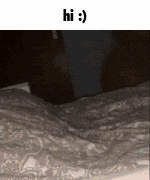

<h2>Kilka słów o mnie</h2>

Nazywam się Mateusz, studiuję na pierwszym roku na kierunku Informatyka i Systemy Inteligentne na AGH. 
    Jestem tutaj, bo od dziecka lubiłem programować i chciałem wybrać studia które mnie rozwiną i mi pomogą w mojej wymarzonej przyszłej
pracy jako programista.

<h3>Kilka ciekawszych słów o mnie</h3>

Poza programowaniem mam jeszcze kilka takich małych obsesji ("obsesyjek"). Jest to m.in. literatura rosyjska, kinematografia oraz gry komputerowe. Żywo mnie interesują również memy, które uważam, poza ich walorami humorystycznymi, za ciekawe zjawisko społeczne oraz formę sztuki. Poza tym absolutnie uwielbiam koty.

